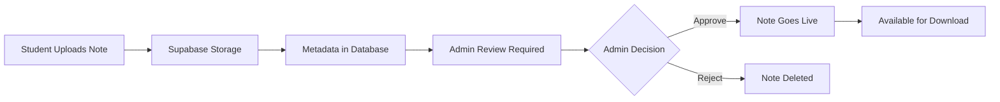
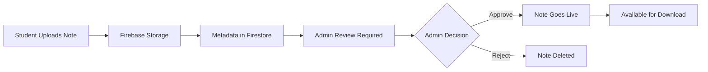
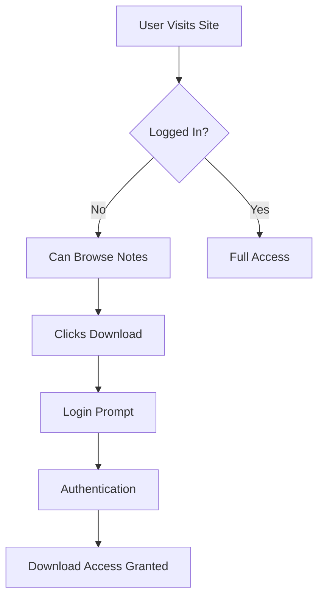

# 📚 Semester Hub

<div align="center">
  
  
  <h3>🎓 Your Premier Academic Note-Sharing Platform</h3>
  
  [](https://reactjs.org/)
  [](https://supabase.com/)
  [](https://tailwindcss.com/)
  [](https://vercel.com/)
  [](LICENSE)
  
  [](https://semester-hub.vercel.app/)
  
  **Empowering students through collaborative learning and secure knowledge sharing**
</div>

---

## 🌟 **Overview**

Semester Hub is a modern, secure, and feature-rich platform designed for students to share, discover, and access high-quality academic notes. Built with cutting-edge technologies including React 18, Supabase, and Tailwind CSS, it offers a seamless experience across all devices while maintaining robust security and authentication systems.

### ✨ **What Makes Semester Hub Special?**

- 🔐 **Authentication-Protected Downloads**: Login required for downloading content
- 📱 **Fully Responsive**: Optimized for smartphones, tablets, laptops, and desktops  
- 🎨 **Modern UI/UX**: Beautiful animations, glass morphism, and appealing visual effects
- 🛡️ **Secure Admin System**: Comprehensive user management with role-based access
- ⚡ **High Performance**: Optimized build with efficient code splitting
- 🌐 **Google Authentication**: Seamless OAuth integration with Google Sign-In
- 🗄️ **Supabase Backend**: Real-time database with row-level security

---

## 🚀 **Key Features**

### 👨‍🎓 **Student Experience**

| Feature | Description | Status |
|---------|-------------|--------|
| 📖 **Browse Notes** | Search and filter academic notes by subject, semester, and keywords | ✅ Active |
| 🔍 **Advanced Search** | Real-time search with instant filtering and sorting options | ✅ Active |
| 📥 **Secure Downloads** | **Login required** to download notes - browse freely, download securely | ✅ Active |
| 📤 **Share Notes** | Upload your own notes with detailed descriptions and tags | ✅ Active |
| 🔐 **User Authentication** | Secure registration and login with Supabase Auth + Google OAuth | ✅ Active |
| 📱 **Mobile Optimized** | Perfect experience on all device types and screen sizes | ✅ Active |
| 💫 **Interactive UI** | Smooth animations, hover effects, and visual feedback | ✅ Active |
| 👤 **User Profiles** | Personalized user profiles with activity tracking | ✅ Active |

### 👨‍💼 **Admin Dashboard**

| Feature | Description | Status |
|---------|-------------|--------|
| 📊 **Analytics Dashboard** | Real-time insights into platform usage and statistics | ✅ Active |
| 👥 **User Management** | Create, ban, unban users with role-based permissions | ✅ Active |
| 📝 **Note Moderation** | Approve, reject, or delete submitted notes | ✅ Active |
| 🛡️ **Admin Creation** | Secure admin account creation with proper authorization | ✅ Active |
| 📈 **Activity Logs** | Track all admin actions and user activities | ✅ Active |
| 🔒 **Security Features** | Row-level security policies and protected routes | ✅ Active |

---

## 🛠️ **Tech Stack**

<table>
<tr>
<td align="center"><strong>Frontend</strong></td>
<td align="center"><strong>Backend & Auth</strong></td>
<td align="center"><strong>Styling & Icons</strong></td>
<td align="center"><strong>Deployment</strong></td>
</tr>
<tr>
<td align="center">
  <br>
  <strong>React 18.2.0</strong><br>
  <small>Modern functional components with hooks</small>
</td>
<td align="center">
  <br>
  <strong>Supabase</strong><br>
  <small>Auth, Database, RLS, Real-time</small>
</td>
<td align="center">
  <br>
  <strong>Tailwind CSS 3.1.6</strong><br>
  <small>Utility-first CSS framework</small>
</td>
<td align="center">
  <br>
  <strong>Vercel</strong><br>
  <small>Production deployment</small>
</td>
</tr>
</table>

**Core Dependencies:**
- **React Router DOM 6.3.0**: Modern client-side routing
- **Lucide React 0.263.1**: Beautiful, customizable icons
- **Supabase JS 2.52.1**: Backend-as-a-Service integration
- **PostCSS & Autoprefixer**: Enhanced CSS processing
- **Vercel Speed Insights**: Performance monitoring

---

## 🚀 **Getting Started**

### Prerequisites
- Node.js (v16 or higher)
- npm or yarn
- Supabase account
- Google Cloud Console (for OAuth)

### Installation

1. **Clone the repository**
   ```bash
   git clone https://github.com/SpicychieF05/semester-hub.git
   cd semester-hub
   ```

2. **Install dependencies**
   ```bash
   npm install
   ```

3. **Set up Supabase**
   - Create a new Supabase project at [https://supabase.com](https://supabase.com)
   - Enable Authentication (Email/Password and Google)
   - Create necessary database tables
   - Configure Row Level Security (RLS) policies

4. **Configure Environment Variables**
   - Update `src/supabase.js` with your Supabase URL and anon key
   - Set up Google OAuth credentials

5. **Run the development server**
   ```bash
   npm start
   ```

6. **Build for production**
   ```bash
   npm run build
   ```

---

## 📁 **Project Structure**

```
semester-hub/
├── 📁 public/
│   ├── 🖼️ images/
│   │   ├── hero-image.gif      # Hero section animation
│   │   └── sm-logo.png         # Brand logo
│   ├── index.html              # HTML template
│   ├── manifest.json          # PWA manifest
│   └── robots.txt             # SEO robots file
├── 📁 src/
│   ├── 📁 components/          # Reusable UI components
│   │   ├── Footer.js          # Site footer with contact modal
│   │   ├── LoadingScreen.js   # Initial loading animation
│   │   ├── LoadingSpinner.js  # Loading indicators
│   │   ├── Navbar.js          # Navigation header
│   │   └── ProtectedAdminRoute.js  # Admin route protection
│   ├── 📁 pages/              # Main application pages
│   │   ├── AdminDashboard.js  # Complete admin management
│   │   ├── AdminLogin.js      # Admin authentication
│   │   ├── AdminSetup.js      # Admin account creation
│   │   ├── BrowseNotes.js     # Notes browsing and search
│   │   ├── HomePage.js        # Landing page
│   │   ├── Login.js           # User authentication
│   │   ├── NoteDetail.js      # Individual note view
│   │   ├── Register.js        # User registration
│   │   └── ShareNotes.js      # Note upload functionality
│   ├── App.js                 # Main application component
│   ├── index.js              # Application entry point
│   ├── index.css             # Global styles
│   └── supabase.js           # Supabase client & auth helpers
├── package.json              # Dependencies and scripts
├── tailwind.config.js        # Tailwind CSS configuration
└── README.md                 # Project documentation
```

---

## 🎯 **Core Workflows**

### 📝 **Note Sharing Process**


### 🔐 **Authentication Flow**


---

## 🎨 **UI/UX Features**

### ✨ **Visual Enhancements**
- **Hero Section**: Animated background with glow effects and glass morphism
- **Responsive Design**: Custom breakpoints for optimal viewing on all devices
- **Interactive Elements**: Hover animations, button transitions, and loading states
- **Modern Icons**: Lucide React icons with consistent styling
- **Color Scheme**: Professional gradient-based color palette
- **Loading Animations**: Custom loading screens with progress indicators

### 📱 **Device Optimization**

| Device Type | Screen Size | Optimizations |
|-------------|-------------|---------------|
| 📱 **Mobile** | 320px - 640px | Touch-friendly UI, single-column layouts |
| 📱 **Tablet** | 641px - 1023px | Adaptive grids, enhanced touch targets |
| 💻 **Laptop** | 1024px - 1279px | Multi-column layouts, hover effects |
| 🖥️ **Desktop** | 1280px+ | Full-width layouts, advanced interactions |

---

## 🚀 **Deployment**

### Vercel Deployment (Recommended)
```bash
# Install Vercel CLI
npm i -g vercel

# Deploy to Vercel
vercel --prod
```

### Manual Build Deployment
```bash
# Build for production
npm run build

# The build folder is ready to be deployed
# Serve the build folder using any static file server
```

### Environment Configuration
Ensure these URLs are configured in your Supabase project:
- **Site URL**: `https://semester-hub.vercel.app`
- **Redirect URLs**: `https://semester-hub.vercel.app/**`

---

## 👨‍💻 **Developer Information**

### 🚀 **Built with ❤️ by Chirantan Mallick**
- 🎓 **BCA 3rd Year Student** at Seacom Skills University
- 💻 **Full Stack Developer** specializing in React & Modern Web Technologies
- 🌟 **Open Source Enthusiast** passionate about education technology

### 📞 **Connect with Developer**
[](https://github.com/spicychief05)
[](https://linkedin.com/in/chirantan-mallick)
[](https://rb.gy/uxjdk)

---

## 🤝 **Contributing**

Contributions are welcome! Please feel free to submit a Pull Request. For major changes, please open an issue first to discuss what you would like to change.

1. Fork the Project
2. Create your Feature Branch (`git checkout -b feature/AmazingFeature`)
3. Commit your Changes (`git commit -m 'Add some AmazingFeature'`)
4. Push to the Branch (`git push origin feature/AmazingFeature`)
5. Open a Pull Request

---

## 📜 **License**

This project is licensed under the MIT License - see the [LICENSE](LICENSE) file for details.

---

## 🆘 **Support & Help**

If you encounter any issues or have questions:

1. **Check the Issues**: Look through existing GitHub issues
2. **Contact Developer**: Use the contact information above
3. **Documentation**: Review this README for setup instructions
4. **Community**: Join our Discord community for help

---

## 🏆 **Acknowledgments**

### 🙏 **Special Thanks**
- **React Team** - For the amazing React framework
- **Supabase Team** - For the powerful backend-as-a-service platform
- **Tailwind CSS** - For the beautiful design system
- **Lucide** - For the elegant icon system
- **Vercel** - For seamless deployment platform

### 🌟 **Inspiration**
This project was inspired by the need for a secure, modern, and user-friendly platform for academic collaboration among students.

---

<div align="center">

### 🎓 **Semester Hub - Empowering Education Through Technology**

**Built with ❤️ by [Chirantan Mallick](https://linktr.ee/chirantan_mallick)**

[](https://github.com/spicychief05/semester-hub)
[](https://github.com/spicychief05/semester-hub/fork)

---

*Last updated: January 2025*

</div>
|---------|-------------|--------|
| 📊 **Analytics Dashboard** | Comprehensive overview of platform statistics and metrics | ✅ Active |
| ✅ **Content Moderation** | Review, approve, or reject submitted notes with detailed controls | ✅ Active |
| 👥 **User Management** | Advanced user controls including ban/unban and admin promotion | ✅ Active |
| 🔒 **Security System** | Automatic admin logout on page refresh for enhanced security | ✅ Active |
| 📈 **Real-time Updates** | Live statistics and user activity monitoring | ✅ Active |
| 🛡️ **Quality Control** | Ensure all published content meets quality standards | ✅ Active |

### 🔐 **Authentication & Security**

- **🚪 Login Required for Downloads**: Users can browse all notes but must authenticate to download
- **🔄 Auto-logout Admin**: Admin sessions automatically expire on page refresh for security
- **🛡️ Protected Routes**: Secure admin areas with authentication verification
- **📧 Multi-provider Auth**: Support for email/password and Google authentication
- **🔑 Session Management**: Secure token handling and user state management

---

## 🛠️ **Tech Stack**

<table>
<tr>
<td align="center"><strong>Frontend</strong></td>
<td align="center"><strong>Backend & Auth</strong></td>
<td align="center"><strong>Styling & Icons</strong></td>
<td align="center"><strong>Deployment</strong></td>
</tr>
<tr>
<td align="center">
  <br>
  <strong>React 18</strong><br>
  <small>Modern functional components</small>
</td>
<td align="center">
  <br>
  <strong>Firebase 9</strong><br>
  <small>Auth, Firestore, Storage</small>
</td>
<td align="center">
  <br>
  <strong>Tailwind CSS</strong><br>
  <small>Responsive design system</small>
</td>
<td align="center">
  <br>
  <strong>Vercel Ready</strong><br>
  <small>Optimized deployment</small>
</td>
</tr>
</table>

**Additional Technologies:**
- **React Router DOM 6**: Modern client-side routing
- **React Firebase Hooks**: Simplified Firebase integration
- **Lucide React**: Beautiful, customizable icons
- **PostCSS & Autoprefixer**: Enhanced CSS processing

---

## 🚀 **Getting Started**

### 📋 **Prerequisites**

```bash
# Required versions
Node.js >= 14.0.0
npm >= 6.0.0 or yarn >= 1.22.0
Git (latest version)
```

### ⚡ **Quick Installation**

```bash
# 1. Clone the repository
git clone https://github.com/spicychief05/semester-hub.git
cd semester-hub

# 2. Install dependencies
npm install

# 3. Set up environment (see Firebase Setup below)
cp .env.example .env.local

# 4. Start development server
npm start

# 5. Open browser
# Navigate to http://localhost:3000
```

### 🔥 **Firebase Setup**

<details>
<summary><strong>📝 Click to expand Firebase configuration steps</strong></summary>

#### 1. Create Firebase Project
- Go to [Firebase Console](https://console.firebase.google.com)
- Click "Create a project"
- Enable Google Analytics (optional)

#### 2. Set up Authentication
```javascript
// Enable these sign-in methods:
- Email/Password ✅
- Google (optional) ✅
```

#### 3. Create Firestore Database
```javascript
// Firestore Rules (production-ready)
rules_version = '2';
service cloud.firestore {
  match /databases/{database}/documents {
    match /notes/{document} {
      allow read: if true;
      allow write: if request.auth != null;
    }
    match /users/{document} {
      allow read, write: if request.auth != null && request.auth.uid == document;
    }
  }
}
```

#### 4. Configure Firebase Storage
```javascript
// Storage Rules
rules_version = '2';
service firebase.storage {
  match /b/{bucket}/o {
    match /notes/{allPaths=**} {
      allow read: if true;
      allow write: if request.auth != null;
    }
  }
}
```

#### 5. Update Configuration
Replace demo config in `src/firebase.js`:
```javascript
const firebaseConfig = {
  apiKey: "your-actual-api-key",
  authDomain: "your-project.firebaseapp.com",
  projectId: "your-project-id",
  storageBucket: "your-project.appspot.com",
  messagingSenderId: "123456789",
  appId: "your-app-id"
};
```

</details>

---

## 📁 **Project Structure**

```
semester-hub/
├── 📁 public/
│   ├── 🖼️ images/
│   │   ├── hero-image.gif      # Hero section animation
│   │   └── sm-logo.png         # Brand logo
│   ├── 🎨 illustrations/
│   │   └── undraw_education_3vwh.svg  # Educational illustration
│   ├── index.html              # HTML template
│   ├── manifest.json          # PWA manifest
│   └── robots.txt             # SEO robots file
├── 📁 src/
│   ├── 📁 components/
│   │   ├── Footer.js          # Site footer with contact modal
│   │   ├── LoadingScreen.js   # Initial loading animation
│   │   ├── LoadingSpinner.js  # Loading indicators
│   │   ├── Navbar.js          # Navigation header
│   │   └── ProtectedAdminRoute.js  # Admin route protection
│   ├── 📁 pages/
│   │   ├── AdminDashboard.js  # Admin management panel
│   │   ├── AdminLogin.js      # Admin authentication
│   │   ├── AdminSetup.js      # Admin configuration
│   │   ├── BrowseNotes.js     # Note browsing & search
│   │   ├── HomePage.js        # Landing page with hero section
│   │   ├── Login.js           # User authentication
│   │   ├── NoteDetail.js      # Individual note view
│   │   ├── Register.js        # User registration
│   │   └── ShareNotes.js      # Note upload form
│   ├── App.js                 # Main application component
│   ├── firebase.js            # Firebase configuration
│   ├── index.css              # Global styles & Tailwind
│   └── index.js               # Application entry point
├── 📄 package.json            # Dependencies & scripts
├── 📄 tailwind.config.js      # Tailwind CSS configuration
├── 📄 postcss.config.js       # PostCSS configuration
└── 📄 vercel.json             # Vercel deployment config
```

---

## 🎯 **Core Workflows**

### 📝 **Note Sharing Process**



### 🔐 **Authentication Flow**



---

## 🎨 **UI/UX Features**

### ✨ **Visual Enhancements**

- **Hero Section**: Animated background with glow effects and glass morphism
- **Responsive Design**: Custom breakpoints for optimal viewing on all devices
- **Interactive Elements**: Hover animations, button transitions, and loading states
- **Modern Icons**: Lucide React icons with consistent styling
- **Color Scheme**: Professional gradient-based color palette

### 📱 **Device Optimization**

| Device Type | Screen Size | Optimizations |
|-------------|-------------|---------------|
| 📱 **Mobile** | 320px - 640px | Touch-friendly UI, single-column layouts |
| 📱 **Tablet** | 641px - 1023px | Adaptive grids, enhanced touch targets |
| 💻 **Laptop** | 1024px - 1279px | Multi-column layouts, hover effects |
| 🖥️ **Desktop** | 1280px+ | Full-width layouts, advanced interactions |

---

## 🚀 **Deployment**

### 🌐 **Deploy to Vercel (Recommended)**

```bash
# 1. Install Vercel CLI
npm install -g vercel

# 2. Build the project
npm run build

# 3. Deploy
vercel --prod

# 4. Set environment variables in Vercel dashboard
```

### 🔧 **Environment Variables**

Create these in your deployment platform:

```env
REACT_APP_FIREBASE_API_KEY=your_api_key
REACT_APP_FIREBASE_AUTH_DOMAIN=your_project.firebaseapp.com
REACT_APP_FIREBASE_PROJECT_ID=your_project_id
REACT_APP_FIREBASE_STORAGE_BUCKET=your_project.appspot.com
REACT_APP_FIREBASE_MESSAGING_SENDER_ID=your_sender_id
REACT_APP_FIREBASE_APP_ID=your_app_id
```

---

## 👨‍💻 **Developer Information**

<table>
<tr>
<td align="center">
  <strong>Chirantan Mallick</strong><br>
  <em>BCA 3rd Year Student</em><br>
  <em>Seacom Skills University</em>
</td>
</tr>
</table>

### 📞 **Connect with Developer**

[](https://github.com/spicychief05)
[](https://linkedin.com/in/chirantan-mallick)
[](https://rb.gy/uxjdk)
[](https://discord.gg/mc2jRBuV)

---

## 🤝 **Contributing**

We welcome contributions! Here's how you can help:

### 🔧 **Development Process**

```bash
# 1. Fork the repository
git fork https://github.com/spicychief05/semester-hub

# 2. Create feature branch
git checkout -b feature/amazing-feature

# 3. Make your changes
# Follow the existing code style and conventions

# 4. Test your changes
npm test
npm run build

# 5. Commit with descriptive message
git commit -m "✨ Add amazing feature"

# 6. Push to your fork
git push origin feature/amazing-feature

# 7. Create Pull Request
# Provide detailed description of changes
```

### 📋 **Contributing Guidelines**

- Follow the existing code style and structure
- Add comments for complex logic
- Test your changes thoroughly
- Update documentation when necessary
- Keep commits atomic and well-described

---

## 📜 **License**

This project is licensed under the **MIT License** - see the [LICENSE](LICENSE) file for details.

### 📄 **License Summary**
- ✅ Commercial use allowed
- ✅ Modification allowed  
- ✅ Distribution allowed
- ✅ Private use allowed
- ❌ Liability protection not provided
- ❌ Warranty not provided

---

## 🆘 **Support & Help**

### 🐛 **Found a Bug?**
- Create an issue with detailed reproduction steps
- Include screenshots if applicable
- Mention your browser and device information

### 💡 **Feature Requests**
- Open a feature request issue
- Describe the feature and its benefits
- Include mockups or examples if possible

### 📧 **Direct Contact**
- **Email**: Available through GitHub profile
- **WhatsApp**: [Direct Chat Link](https://rb.gy/uxjdk)
- **Discord**: Join [Codiverse Server](https://discord.gg/mc2jRBuV)

---

## 🏆 **Acknowledgments**

### 🙏 **Special Thanks**

- **React Team** - For the amazing React framework
- **Firebase Team** - For robust backend services
- **Tailwind CSS** - For the beautiful design system
- **Lucide** - For the elegant icon system
- **Vercel** - For seamless deployment platform

### 🌟 **Inspiration**

This project was inspired by the need for a secure, modern, and user-friendly platform for academic collaboration among students.

---

<div align="center">
  
### 🎓 **Semester Hub - Empowering Education Through Technology**

**Built with ❤️ by [Chirantan Mallick](https://linktr.ee/chirantan_mallick)**

[](https://github.com/spicychief05/semester-hub)
[](https://github.com/spicychief05/semester-hub/fork)

---

*Last updated: July 2025*

</div>
   ```

2. **Install dependencies**
   ```bash
   npm install
   ```

3. **Set up Firebase**
   - Create a new Firebase project at [https://console.firebase.google.com](https://console.firebase.google.com)
   - Enable Authentication (Email/Password and Google)
   - Create a Firestore database
   - Enable Storage
   - Copy your Firebase config

4. **Configure Firebase**
   - Update `src/firebase.js` with your Firebase configuration:
   ```javascript
   const firebaseConfig = {
     apiKey: "your-api-key",
     authDomain: "your-project.firebaseapp.com",
     projectId: "your-project-id",
     storageBucket: "your-project.appspot.com",
     messagingSenderId: "your-sender-id",
     appId: "your-app-id"
   };
   ```

5. **Set up Firestore Rules**
   ```javascript
   rules_version = '2';
   service cloud.firestore {
     match /databases/{database}/documents {
       match /notes/{document} {
         allow read: if true;
         allow write: if request.auth != null;
       }
       match /users/{document} {
         allow read, write: if request.auth != null && request.auth.uid == document;
       }
     }
   }
   ```

6. **Set up Storage Rules**
   ```javascript
   rules_version = '2';
   service firebase.storage {
     match /b/{bucket}/o {
       match /notes/{allPaths=**} {
         allow read: if true;
         allow write: if request.auth != null;
       }
     }
   }
   ```

7. **Start the development server**
   ```bash
   npm start
   ```

8. **Open your browser**
   Navigate to [http://localhost:3000](http://localhost:3000)

### Admin Setup

To access the admin dashboard:
1. Create an account with the email: `admin@semesterhub.com`
2. This email will have admin privileges and access to the admin dashboard

## Project Structure

```
src/
├── components/
│   ├── Navbar.js              # Navigation component
│   └── LoadingSpinner.js      # Loading indicator
├── pages/
│   ├── HomePage.js            # Landing page
│   ├── BrowseNotes.js         # Browse and search notes
│   ├── ShareNotes.js          # Upload new notes
│   ├── NoteDetail.js          # Individual note view
│   ├── AdminDashboard.js      # Admin panel
│   ├── Login.js               # User authentication
│   └── Register.js            # User registration
├── firebase.js                # Firebase configuration
├── App.js                     # Main app component
├── index.js                   # Entry point
└── index.css                  # Global styles
```

## Key Features Implementation

### Note Sharing Workflow
1. **User uploads note** → Stored in Firebase Storage
2. **Note metadata saved** → Firestore with "pending" status
3. **Admin reviews** → Can approve or reject
4. **Approved notes** → Visible in browse section
5. **Users can download** → Download count tracked

### Admin Review System
- All uploaded notes require admin approval
- Admin can view note details before approving
- Rejected notes are automatically deleted
- Real-time statistics and monitoring

### Search and Filtering
- Full-text search across titles and descriptions
- Filter by subject and semester
- Real-time results as user types
- Responsive grid layout

## Deployment

### Deploy to Vercel

1. **Install Vercel CLI**
   ```bash
   npm install -g vercel
   ```

2. **Build the project**
   ```bash
   npm run build
   ```

3. **Deploy**
   ```bash
   vercel --prod
   ```

### Environment Variables
Set these in your Vercel dashboard:
- `REACT_APP_FIREBASE_API_KEY`
- `REACT_APP_FIREBASE_AUTH_DOMAIN`
- `REACT_APP_FIREBASE_PROJECT_ID`
- `REACT_APP_FIREBASE_STORAGE_BUCKET`
- `REACT_APP_FIREBASE_MESSAGING_SENDER_ID`
- `REACT_APP_FIREBASE_APP_ID`

## Contributing

1. Fork the repository
2. Create a feature branch (`git checkout -b feature/amazing-feature`)
3. Commit your changes (`git commit -m 'Add amazing feature'`)
4. Push to the branch (`git push origin feature/amazing-feature`)
5. Open a Pull Request

## License

This project is licensed under the MIT License - see the [LICENSE](LICENSE) file for details.

## Support

For support and questions:
- Create an issue in the repository
- Email: support@semesterhub.com

## Acknowledgments

- Built with React and Firebase
- Icons by Lucide React
- Styled with Tailwind CSS
- Deployed on Vercel

---

**Semester Hub** - Empowering students through collaborative learning and knowledge sharing.
