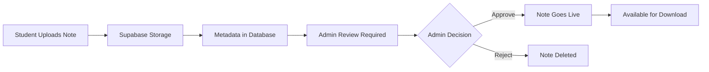

# 📚 Semester Hub

<div align="center">
  
  
  <h3>🎓 Your Premier Academic Note-Sharing Platform</h3>
  
  [](https://reactjs.org/)
  [](https://supabase.com/)
  [](https://tailwindcss.com/)
  [](https://vercel.com/)
  [](LICENSE)
  
  [](https://semester-hub.vercel.app/)
  
  **Empowering students through collaborative learning and secure knowledge sharing**
</div>

---

## 🌟 **Overview**

Semester Hub is a modern, secure, and feature-rich platform designed for students to share, discover, and access high-quality academic notes. Built with cutting-edge technologies including React 18, Supabase, and Tailwind CSS, it offers a seamless experience across all devices while maintaining robust security and authentication systems.

### ✨ **What Makes Semester Hub Special?**

- 🔐 **Authentication-Protected Downloads**: Login required for downloading content
- 📱 **Fully Responsive**: Optimized for smartphones, tablets, laptops, and desktops  
- 🎨 **Modern UI/UX**: Beautiful animations, glass morphism, and appealing visual effects
- 🛡️ **Secure Admin System**: Comprehensive user management with role-based access
- ⚡ **High Performance**: Optimized build with efficient code splitting
- 🌐 **Google Authentication**: Seamless OAuth integration with Google Sign-In
- 🗄️ **Supabase Backend**: Real-time database with row-level security

---

## 🚀 **Key Features**

### 👨‍🎓 **Student Experience**

| Feature | Description | Status |
|---------|-------------|--------|
| 📖 **Browse Notes** | Search and filter academic notes by subject, semester, and keywords | ✅ Active |
| 🔍 **Advanced Search** | Real-time search with instant filtering and sorting options | ✅ Active |
| 📥 **Secure Downloads** | **Login required** to download notes - browse freely, download securely | ✅ Active |
| 📤 **Share Notes** | Upload your own notes with detailed descriptions and tags | ✅ Active |
| 🔐 **User Authentication** | Secure registration and login with Supabase Auth + Google OAuth | ✅ Active |
| 📱 **Mobile Optimized** | Perfect experience on all device types and screen sizes | ✅ Active |
| 💫 **Interactive UI** | Smooth animations, hover effects, and visual feedback | ✅ Active |
| 👤 **User Profiles** | Personalized user profiles with activity tracking | ✅ Active |

### 👨‍💼 **Admin Dashboard**

| Feature | Description | Status |
|---------|-------------|--------|
| 📊 **Analytics Dashboard** | Real-time insights into platform usage and statistics | ✅ Active |
| 👥 **User Management** | Create, ban, unban users with role-based permissions | ✅ Active |
| 📝 **Note Moderation** | Approve, reject, or delete submitted notes | ✅ Active |
| 🛡️ **Admin Creation** | Secure admin account creation with proper authorization | ✅ Active |
| 📈 **Activity Logs** | Track all admin actions and user activities | ✅ Active |
| 🔒 **Security Features** | Row-level security policies and protected routes | ✅ Active |

---

## 🛠️ **Tech Stack**

<table>
<tr>
<td align="center"><strong>Frontend</strong></td>
<td align="center"><strong>Backend & Auth</strong></td>
<td align="center"><strong>Styling & Icons</strong></td>
<td align="center"><strong>Deployment</strong></td>
</tr>
<tr>
<td align="center">
  <br>
  <strong>React 18</strong><br>
  <small>Modern functional components</small>
</td>
<td align="center">
  <br>
  <strong>Supabase</strong><br>
  <small>Auth, Database, RLS, Real-time</small>
</td>
<td align="center">
  <br>
  <strong>Tailwind CSS</strong><br>
  <small>Responsive design system</small>
</td>
<td align="center">
  <br>
  <strong>Vercel Ready</strong><br>
  <small>Optimized deployment</small>
</td>
</tr>
</table>

**Additional Technologies:**
- **React Router DOM 6**: Modern client-side routing
- **Lucide React**: Beautiful, customizable icons
- **Supabase JS**: Backend-as-a-Service integration
- **PostCSS & Autoprefixer**: Enhanced CSS processing

---

## 🚀 **Getting Started**

### Prerequisites
- Node.js (v16 or higher)
- npm or yarn
- Supabase account
- Google Cloud Console (for OAuth)

### Installation

1. **Clone the repository**
   ```bash
   git clone https://github.com/SpicychieF05/semester-hub.git
   cd semester-hub
   ```

2. **Install dependencies**
   ```bash
   npm install
   ```

3. **Set up Supabase**
   - Create a new Supabase project at [https://supabase.com](https://supabase.com)
   - Enable Authentication (Email/Password and Google)
   - Create necessary database tables
   - Configure Row Level Security (RLS) policies

4. **Configure Environment Variables**
   - Update `src/supabase.js` with your Supabase URL and anon key
   - Set up Google OAuth credentials

5. **Run the development server**
   ```bash
   npm start
   ```

6. **Build for production**
   ```bash
   npm run build
   ```
---

## 📁 **Project Structure**

```
semester-hub/
├── 📁 public/
│   ├── 🖼️ images/
│   │   ├── hero-image.gif      # Hero section animation
│   │   └── sm-logo.png         # Brand logo
│   ├── index.html              # HTML template
│   ├── manifest.json          # PWA manifest
│   └── robots.txt             # SEO robots file
├── 📁 src/
│   ├── 📁 components/          # Reusable UI components
│   │   ├── Footer.js          # Site footer with contact modal
│   │   ├── LoadingScreen.js   # Initial loading animation
│   │   ├── LoadingSpinner.js  # Loading indicators
│   │   ├── Navbar.js          # Navigation header
│   │   └── ProtectedAdminRoute.js  # Admin route protection
│   ├── 📁 pages/              # Main application pages
│   │   ├── AdminDashboard.js  # Complete admin management
│   │   ├── AdminLogin.js      # Admin authentication
│   │   ├── AdminSetup.js      # Admin account creation
│   │   ├── BrowseNotes.js     # Notes browsing and search
│   │   ├── HomePage.js        # Landing page
│   │   ├── Login.js           # User authentication
│   │   ├── NoteDetail.js      # Individual note view
│   │   ├── Register.js        # User registration
│   │   └── ShareNotes.js      # Note upload functionality
│   ├── App.js                 # Main application component
│   ├── index.js              # Application entry point
│   ├── index.css             # Global styles
│   └── supabase.js           # Supabase client & auth helpers
├── package.json              # Dependencies and scripts
├── tailwind.config.js        # Tailwind CSS configuration
└── README.md                 # Project documentation
```

---

## 🎯 **Core Workflows**

### 📝 **Note Sharing Process**


### 🔐 **Authentication Flow**


---

## 🎨 **UI/UX Features**

### ✨ **Visual Enhancements**
- **Hero Section**: Animated background with glow effects and glass morphism
- **Responsive Design**: Custom breakpoints for optimal viewing on all devices
- **Interactive Elements**: Hover animations, button transitions, and loading states
- **Modern Icons**: Lucide React icons with consistent styling
- **Color Scheme**: Professional gradient-based color palette
- **Loading Animations**: Custom loading screens with progress indicators

### 📱 **Device Optimization**

| Device Type | Screen Size | Optimizations |
|-------------|-------------|---------------|
| 📱 **Mobile** | 320px - 640px | Touch-friendly UI, single-column layouts |
| 📱 **Tablet** | 641px - 1023px | Adaptive grids, enhanced touch targets |
| 💻 **Laptop** | 1024px - 1279px | Multi-column layouts, hover effects |
| 🖥️ **Desktop** | 1280px+ | Full-width layouts, advanced interactions |

---

## 🚀 **Deployment**

### Vercel Deployment (Recommended)
```bash
# Install Vercel CLI
npm i -g vercel

# Deploy to Vercel
vercel --prod
```

### Manual Build Deployment
```bash
# Build for production
npm run build

# The build folder is ready to be deployed
# Serve the build folder using any static file server
```

### Environment Configuration
Ensure these URLs are configured in your Supabase project:
- **Site URL**: `https://semester-hub.vercel.app`
- **Redirect URLs**: `https://semester-hub.vercel.app/**`

---

## 👨‍💻 **Developer Information**

### 🚀 **Built with ❤️ by Chirantan Mallick**
- 🎓 **BCA 3rd Year Student** at Seacom Skills University
- 💻 **Full Stack Developer** specializing in React & Modern Web Technologies
- 🌟 **Open Source Enthusiast** passionate about education technology

### 📞 **Connect with Developer**
[](https://github.com/spicychief05)
[](https://linkedin.com/in/chirantan-mallick)
[](https://rb.gy/uxjdk)

---

## 🤝 **Contributing**

Contributions are welcome! Please feel free to submit a Pull Request. For major changes, please open an issue first to discuss what you would like to change.

1. Fork the Project
2. Create your Feature Branch (`git checkout -b feature/AmazingFeature`)
3. Commit your Changes (`git commit -m 'Add some AmazingFeature'`)
4. Push to the Branch (`git push origin feature/AmazingFeature`)
5. Open a Pull Request

---

## 📜 **License**

This project is licensed under the MIT License - see the [LICENSE](LICENSE) file for details.

---

## 🆘 **Support & Help**

If you encounter any issues or have questions:

1. **Check the Issues**: Look through existing GitHub issues
2. **Contact Developer**: Use the contact information above
3. **Documentation**: Review this README for setup instructions
4. **Community**: Join our Discord community for help

---

## 🐛 **Bug Report Feature**

Semester Hub includes a built-in bug reporting system that allows users to report issues directly through the platform:

### 🎯 **How It Works**
- **User-Friendly Interface**: Accessible bug report modal in the footer section
- **Authentication Required**: Users must be logged in to submit bug reports
- **Direct Communication**: Reports are sent directly to the developer's email
- **Detailed Information**: Includes user information and timestamp for better support

### 📝 **Reporting Process**
1. **Login Required**: Users need to authenticate before reporting bugs
2. **Access via Footer**: Click "Bug Report" in the Contact & Support section
3. **Fill Details**: Provide page information and detailed bug description
4. **Submit**: Report is sent directly to `mallickchirantan@gmail.com`
5. **Follow-up**: Developer can respond directly for resolution

### 🛡️ **Security & Privacy**
- User information is only collected for support purposes
- Reports include user name, email, and timestamp
- No sensitive data is transmitted
- Used exclusively for bug tracking and resolution

This feature ensures quick communication between users and the development team, enabling faster bug fixes and platform improvements.

---

## 🏆 **Acknowledgments**

### 🙏 **Special Thanks**
- **React Team** - For the amazing React framework
- **Supabase Team** - For the powerful backend-as-a-service platform
- **Tailwind CSS** - For the beautiful design system
- **Lucide** - For the elegant icon system
- **Vercel** - For seamless deployment platform

### 🌟 **Inspiration**
This project was inspired by the need for a secure, modern, and user-friendly platform for academic collaboration among students.

---

<div align="center">

### 🎓 **Semester Hub - Empowering Education Through Technology**

**Built with ❤️ by [Chirantan Mallick](https://linktr.ee/chirantan_mallick)**

[](https://github.com/spicychief05/semester-hub)
[](https://github.com/spicychief05/semester-hub/fork)

---

*Last updated: July 2025*

</div>


